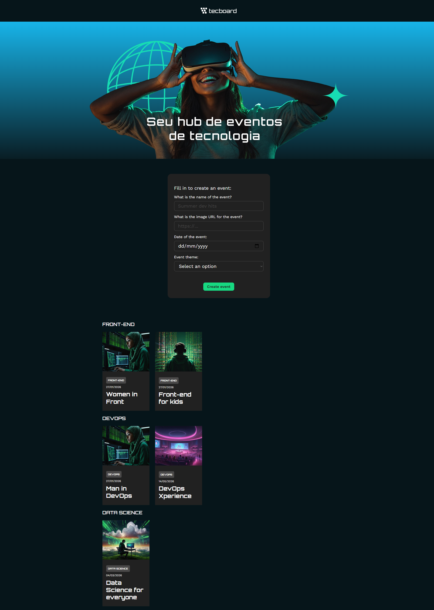

# Tecboard

Your technology events hub! This project was built with React and aims to make it easier to create and view events focused on topics such as Front-end, Back-end, Cloud, and much more.

## 🔨 Project features

- Creation of custom events with image, title, date, and theme.
- Organization of events by theme.
- Data persistence in memory (local React state).



## ✔️ Techniques and technologies used

- **React + Vite**: Lightweight structure for React development.
- **useState**: For managing the local state of events.
- **Componentization**: Clear separation of responsibilities by component.
- **Forms with `FormData`**: Structured data capture.
- **CSS Modules**: Styles organized per component with local scope.
- **Google Fonts (Work Sans + Orbitron)**: Custom typography.

## 🛠️ How to run the project

1. Clone the repository:

```bash
git clone https://github.com/iRafah/tecboard.git
cd tecboard
```

2. Install the dependencies:

```bash
npm install
```

3. Run the project locally:

```bash
npm run dev
```

4. Open it in your browser:

```
http://localhost:5173
```

## 📚 About the project

This project was developed for educational purposes to practice:

- Componentization in React.
- JSX.
- Form and data handling.
- Styling with CSS.
- Use of props and conditional rendering

Ideal for those who want to take their first steps in React by building something visual, interactive, and useful.

If you want to add deployment with Vercel, persistence with LocalStorage, or a backend with Firebase, this project is a great foundation to evolve!